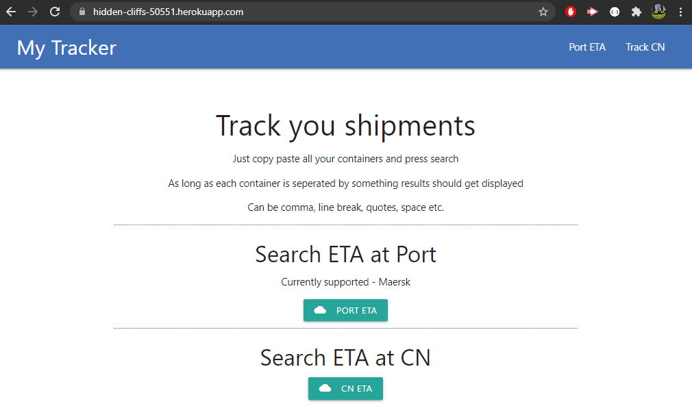
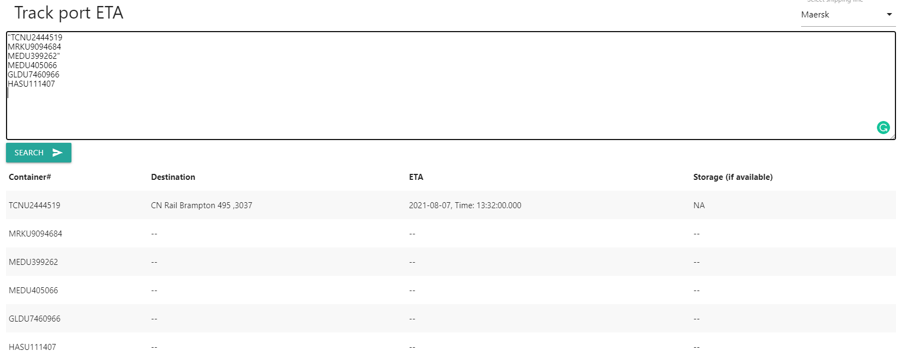
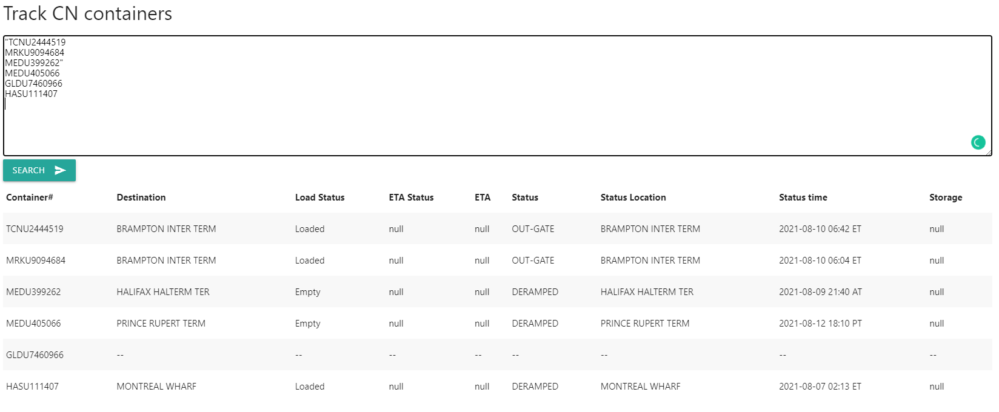

# Check Eta
## Version 1.0
## Description
Helps track estimated time of arrivals of containers in bulk, displaying the results in a table. 

## Table of Contents
* [License](#license)
* [Installation](#installation)
* [Usage](#usage)
* [Feature](#feature)
* [Tools](#credits)
* [Author](#author)

## License

## Installation
No installation required.

[Link to the deployed app](https://pure-eyrie-01841.herokuapp.com/)

## Usage
* Provides user option to search containers eta at port or the rail yard.

* Copy paste multiple containers for port or CN and all results will be displayed if available
* Containers will show blank dashes if it is not shipped by hte selected carrier or CN.

## Feature
* Automatically formats the container numbers to 10 digits before sending request to CN
* Automatically identifies multiple containers if seperated by anything other than alphanumneric. Can be a space, comma, line break etc. This allows user simply copy paste data from email or excel sheets and get results.

## Tools
* [Express](https://www.npmjs.com/package/express)
* [Handlebars](https://www.npmjs.com/package/handlebars)
* [dotenv](https://www.npmjs.com/package/dotenv)
* [Axios](https://www.npmjs.com/package/axios)

# Author
* Abhishek Jamwal - [GitHub](https://github.com/jamwalab)